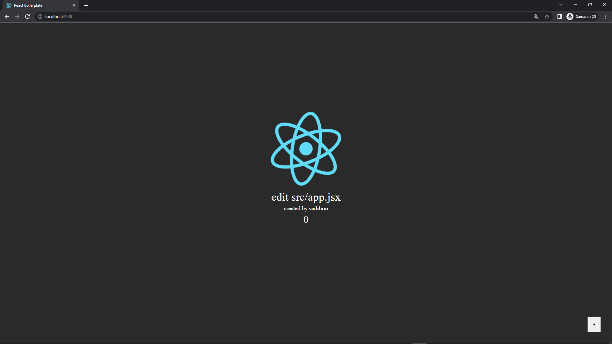

<p style="text-align: center; padding: 20px 0px;">

</p>

# React Boilerplate Starter Kit V1

<p style="font-size: 18px; padding: 20px 0px">this is a small starter kit pack react with webpack,babel loader,css loader,sass loader, eslint. I made this starter kit when I realized that create-react-app slow loadded in my computer. Hope this is can help you for build your front end stuff.<p>



## - First Configuration

```
git clone https://github.com/saddam-satria/react-boilerplate

yarn install
```

> Use yarn instead npm for package manager

## - Development Mode

```
yarn start
```

> the browser will serve [localhost:3000](http://localhost:3000)

## - Production Mode

```
yarn run build
```

> webpack will generate all bundle file into build folder

<h2 style="color: red; font-weight: 700;">
    TIPS
</h2>
<ul>
    <li>in the production mode, every files in public folder will copy to the build folder</li>
    <li>In the webpack dev server,I preffered use live reload instead of hot reload. If you want configure hot reload, change in webpack.config.js</li>
    <li>All static file serve with the root file, which is /. file locate in the public folder</li>
</ul>

## - Lint

```
yarn run lint
```

> eslint will fix the error problems with your code, based on .eslintrc config file, if you don't want it, change yourself style in .eslintrc.js file

## - Prettier

```
yarn run prettier
```

> prettier will clean up your code lines

<h3>latest features</h3>
<ul>
    <li>Eslint</li>
    <li>React 18</li>
    <li>Redux</li>
    <li>Testing library</li>
    <li>Husky pre commit</li>
    <li>Prettier</li>
    <li>Support SASS</li>
</ul>

<h3> made with ❤️ by Saddam Satria </h3>
<div style="padding: 10px 0px"> 
    <a href="https://www.linkedin.com/in/saddam-satria-ardhi-837570170/"></a>
    <a href="https://www.instagram.com/saddamsatria_12/"></a>
    
</div>
